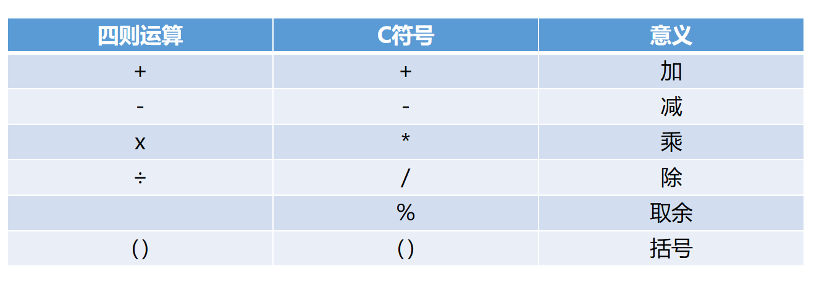
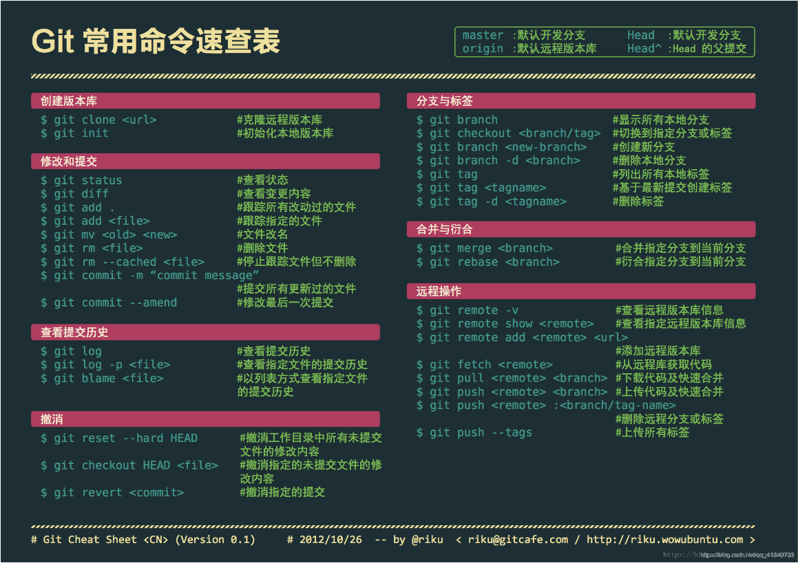
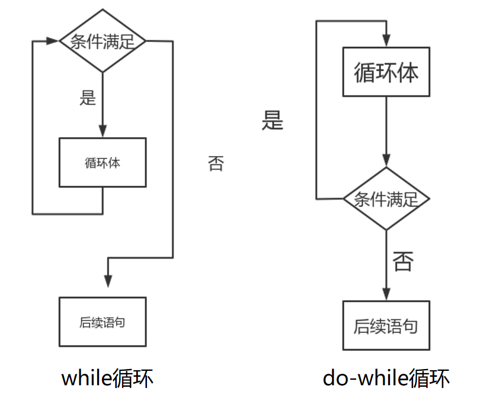
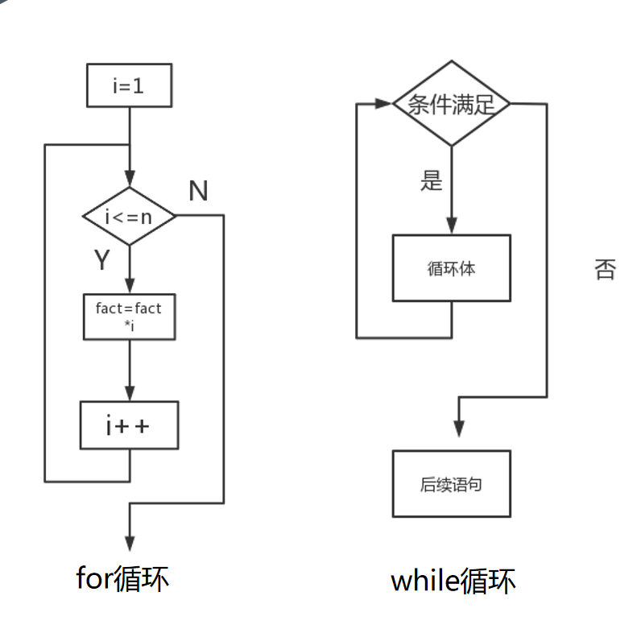

# 8.1~8.7笔记

--------

## 8.1

晚上8点开始听网络安全专业启蒙沙龙，其中提到了pwn，re，misc（安全杂项），洛谷等专业名词，了解网安专业方向的多样性，在未来的学习中我们要选定一个方向去钻研。之后由毕业学长为我们介绍网安的未来就业前景和现状，最后总结结束了沙龙。

-------

## 8.2

今天讲的是C语言基础，学习了一下四点内容：

**1.c语言概述**

- 介绍了什么是C语言

- 为什么要学习C语言

**2.第一个c语言程序**

第一个C语言程序便是最经典的“Hello World!”

```c
#include <studio.h>//导包
int main()//主函数
{
    printf("Hello World!\n");//输出
    return 0;//程序正常退出
}
```

<!--一定要注意程序格式不然在开学后用的pta程序会跑不起来-->

>“ ”里面的内容叫做字符串，printf会把""中的内容原封不动地输出
>>\n表示需要在输出的结果后面换行
>>> %d说明后面有一个**整数**要输出在这个位置上

```c
printf("13+14=%d\n",13+14);
```
那么此时就会输出13+14=27
<!--注意中文的分号；和英文的;的区别-->

**3.变量**

- 变量：变量是一个保存数据的地方

变量定义的一般形式就是：**<类型名称><变量名称>;**

```c
int a;
int a,b;//在同一行中可以定义多个变量
```

C语言关键字不可以做标识符（变量的名字）如：**int,break,case**

- 赋值和初始化

```c
int price = 0//此时的赋值叫做初始化
```

这里的“=”是一个赋值运算符，**表示将“=“右边的值赋给左边**

a=b和b=a在程序设计中与数学中不一样，在程序设计中相当于两个意思

a=b相当于叫计算机把b的值给a，反之亦然

例如：

```c
#include <stdio.h> 
int main()
{
    int a=4;
    int b=2;
    a=b;
    printf("a=%d\n",a);
    return 0;
}
```

此时程序运行便会输出a=2

**4.浮点数**

- 浮点数：带有小数点的数

10是整数(int)，而10.0是浮点数

C语言中采用float和double关键字来定位浮点数

float：单精度浮点数(可以表示6到7位有效数字)

double：双精度浮点数(可有表示15到16位有效数字)

```c
float a;
scanf("%f",&a);
printf("%f",&a);

double b:
scanf("%lf",&b);
prinf("%f",b);
```

当浮点数和整数放在一起运算时，C会将整数转换成浮点数，然后进行浮点数运算

- 表达式

运算符:是指进行运算的动作，比如加法运算符"+",减法运算符"-"

算子：是指参与运算的之，这个值可能是常数，也可能是变量，还可能是一个方法的返回值

比如：a=b+6;

那么其中运算符有"="、"+"，算子有”a“、”b“、”6“



遵循先乘除后加减的运算规则（取余也算除法运算）可以通过括号改变运算顺序

--------

## 8.3



克隆仓库：git clone git地址
初始化仓库：git init 
添加文件到暂存区：git add -A 
把暂存区的文件提交到仓库：git commit -m
查看提交的历史记录：git log --stat
工作区回滚：git checkout filename
撤销最后一次提交：git reset HEAD^1
以当前分支为基础新建分支：git checkout -b branchname
列举所有的分支：git branch 
单纯地切换到某个分支：git checkout branchname 
删掉特定的分支：git branch -D branchname 
合并分支：git merge branchname 
放弃合并：git merge --abort 
添加远程仓库：git remote add origin
本地仓库改名：git branch -M main
上传代码：git push -u origin main
推送当前分支最新的提交到远程：git push
拉取远程分支最新的提交到本地：git pull

以上是git相关代码，也可以在`vscode`下载`GitLens`扩展插件来进行图形化操作，省去次次打代码 ~~复制代码~~ 的麻烦。

学习了git相关的工作原理和如何在vscode中使用git来进行上传本地内容到github上建立的远程仓库中。但学习的仍然浅显，还需在多次实践和复习巩固中，了解掌握git的使用。

假如我要更新个人博客的话，由于github在国内链接不稳定，通过vscode的powershell终端不一定能成功将本地库成功上传更新，所以我可以通过梯子来帮助，在梯子中打开cmd终端，先直接输入`<目标硬盘>:`进入到目标硬盘后，再输入`cd\<目标硬盘>\<目标文件夹>`打开我的blog文件夹，此时输入以下三条指令：

```
git add .                      添加所有修改的文件
git commit -m '文字内容'         更新日志（文字内容可替换）
git push                       （推送更新）
```

就能实现将本地文件夹中的内容上传到远程仓库，更新自己的博客了。


--------

## 8.4

今天讲的是C语言分支，主要有以下两点内容：

**1.条件判断**

if(条件成立){...}如果条件成立，执行大括号里的内容，反之不执行，会跳过大括号里的内容。


- 关系运算的结果：当两个值的关系符合关系运算符的预期时，关系运算的结果为整数1，否则为整数0

```c
printf`(“%d\n”,5==3);
printf(“%d\n”,5>3);
printf(“%d\n”,5<=3);
```

- 优先级：所有的关系运算符的优先级比算术运算的低，但是比赋值运算的高

`7>=3+4` 优先级高于`int r = a>0;`

`==`和`！=`的优先级比其他的低，而连续的关系运算是从左到右进行的

`5>3==6>4`  `6>5>4` `a==b==6` `a==b>0`

- 注释：插入在程序代码中，用来向读者提高解释信息。它们对程序没有任何影响，但是往往使得程序更容易被人类读者理解。

注释分为：`//`和`/**/`

`//`是单行注释，`/**/`是多行注释，以`/*`开始,以`*/`结束

**如果**

如果条件不满足，做另一件事

else=否则的话

```c
if(条件){
    ...
}else{
    ...
}
```

if语句

一个基本的if语句由一个关键字开头，跟在括号里的一个表示条件的逻辑表达式，然后是一对大括号”{}”之间的若干条语句。如果表示条件的逻辑表达式的结果不是零，那么就执行后面跟着的这对大括号中的语句，否则就跳过这些语句不执行，而执行下面的其他语句。

```c
f(total>amount)  total=total+amount+10;
```

if语句这一行结束的时候并没有表示语句结束的“；”，而在后面的赋值语句写在if的下一行，并且缩进了，在这一行结束的时候有一个表示语句结束的“；”。这表明这条赋值语句是if语句的一部分，if语句拥有和控制这条赋值语句，决定它是否要被执行。

PS：以下是某学长给予的宝贵知识，此处整合到周报中用来一并记忆学习

## if-else

```c
if(条件) {
    执行语句
} else {
    执行语句
}
```

`else` 是可有可无的

当 `if` 条件满足时会执行 `if` 里面的语句，否则

- 如果有 `else` 则执行 `else`

  - 如果 `else` 后有 `if` ，将会再次判断是否符合，否则执行 `else`

    ```c
    int a = 10;
    if(a>100) {
        printf("a大于100");
        xxxxxx;
    }else if(a>10) {
        printf("a大于10且小于等于100");
    }else if(a>5) {
        printf("a大于5且a小于等于10");
    }else{
        printf("a小于等于5");
    }
    ```

    区别：

    ```c
    int a = 20;
    if(a>100) {
        printf("a大于100");
    }//else{}
    if(a>10) {
        printf("a大于10且小于等于100");
    }//else{}
    if(a>5) {
        printf("a大于5且a小于等于10");
    }else{
        printf("a小于等于5");
    }
    ```

- 如果没有 `else` 将不会执行

if简写

```c
if(a>10) printf("a大于10");
else {printf("a小于等于10");xxxxxx;}
```

if 嵌套

```c
if(a) {
    if(b) {
        xxx
    }else{
        xxxx
    }
}else{
    xxxxx
}
```

**2.循环**

while(条件){...}从语法角度看循环和if类似，区别在于if指只会执行一次，while会执行多次。


- **while循环**

如果我们把while翻译作“当”，那么一个while循环的意思是：当条件满足时，不断地重复循环体内的语句。循环之前需要判断是否符合条件才能进入循环，所以有可能循环一次也没执行。条件成立是循环继续的基础。

验证：测试程序常使用边界数据，如有效范围两端的数据，特殊的倍数等，在代码执行前一般都需要模拟一下。

- **do-while循环**

在进入循环体的时候不做检查，而是在执行完一轮循环体的代码后，再来检查循环的条件是否满足，如果满足则继续下一轮循环，不满足则结束循环。

```c
do
{	<循环体语句>
}while(<循环条件>);

```



do-while循环和while循环很像，区别在循环体执行结束的时候才来判断条件。也就是说，无论如何，`循环都会执行至少一边遍`，然后再来判断条件。与while循环相同的是，条件满足时执行循环，条件不满足时结束循环。

- **for循环**

```c
for(初始条件；循环继续条件；循环每一轮要做的事情）{

......
}
```

for循环像一个计数循环：设定一个计数器，初始化它，然后在计数器到达某值之前，重复执行循环体，而每执行一轮循环，计数器值以一定步骤进行调整，比如加1或者减1。例如：

```c
#include <stdio.h> 
int main()
{
	for(int i=0;i<5;i=i+1){
    printf("%d",i);
}
	return 0;
}
```

这个代码会不断执行循环，直到i=5时，程序会停止循环，结果输出为01234

for=对于

for(count=10;count>0;count--)就读成：”对于一开始的count=10,当count>0时，重复做循环体，每一轮循环在做完循环体语句后，使得count--。“

<!--Tips：做求和的程序时，记录结果的变量应该初始化为0，而做求和积的变量时，记录结果的变量应该初始化为1-->

- **循环次数**

for(i=0;i<n;i++)则循环的次数是n，而循环结束以后，i的值是n.循环的控制变量i，是选择从0开始还是从1开始，是判断i<n还是判断i<=n；对循环的次数，循环结束后变量的值有影响。



如果有固定次数，用for如果必须执行一次，用do-while其他情况用while

-----

## 8.5

今天事情比较多，没学习新的东西，只回顾了几遍笔记。在晚上读了读《提问的智慧》，受益匪浅。

[提问的智慧]: https://github.com/ryanhanwu/How-To-Ask-Questions-The-Smart-Way/blob/main/README-z

--------

## 8.6

今天讲的是C语言的进一步判断和循环,主要学习的是以下两点：

**1.级联和嵌套的判断**

- **级联**

类似于分段函数
if
else if
else
不用再进else里的大括号
单一出口原则程序里操作不要多次输出

- **嵌套**

如果if条件满足或不满足时，又进一个if 这就是if的嵌套语句。
缩进不能影响else的匹配。在没有大括号时，else跟最近的if匹配。在if或else后始终用{}。

此处内容与8.4中if-else的内容相近，就不再详细记录了。

**2.多支分路**

- **switch-case**

```c
switch(控制表达式）{case 常量：
语句
......
case 常量：
语句
......
default:
语句
......
}
```

控制表达式只能是整数型的结果常量可以是常数，也可以是常数计算的表达式。

不会像级联一样 从头判断，控制表达式只能是整数型（int）结果
如果没有break 会顺序执行下面的case case只是跳转，我们可以利用这个特性来进行不同需求的程序设计。

-----

## 8.7

今天打算在完成C语言作业之余，多去了解些C语言相关知识，继续阅读《提问的智慧》，争取在今后的学习中，能够更好的提出有意义 的提问，得到学长们的有效解答。QWQ

以上就是这七天中学习的东西。
