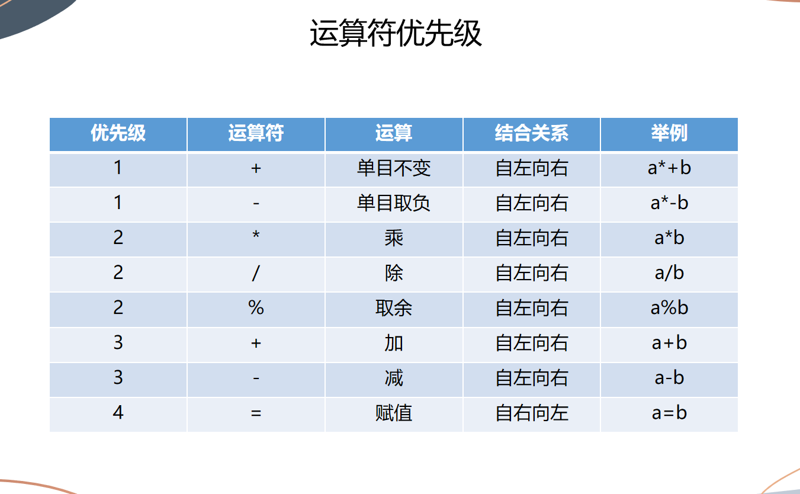

# 8.1~8.7周报

--------

## 8.1

晚上8点开始听网络安全专业启蒙沙龙，听了c10uds大佬的讲解介绍，其中提到了pwn，re，misc（安全杂项），洛谷等专业名词，知道了网安专业方向的多样性，在未来的学习中最好要选定一个方向去钻研。后来由毕业学长为我们介绍网安的未来就业前景和现状，最后做了总结结束了沙龙。

-------

## 8.2

今天讲的是C语言基础，由王翔学长主讲，学习了一下四点内容：

**1.c语言概述**

- 介绍了什么是C语言

- 为什么要学习C语言

**2.第一个c语言程序**

第一个C语言程序便是最经典的“Hello World!”

```c
#include <studio.h>//导包
int main()//主函数
{
    printf("Hello World!\n");//输出
    return 0;//程序正常退出
}
```

<!--一定要注意程序格式不然在开学后用的pta程序会跑不起来-->

>“ ”里面的内容叫做字符串，printf会把""中的内容原封不动地输出
>>\n表示需要在输出的结果后面换行
>>> %d说明后面有一个**整数**要输出在这个位置上

```c
printf("13+14=%d\n",13+14);
```
那么此时就会输出13+14=27
<!--注意中文的分号；和英文的;的区别-->

**3.变量**

- 变量：变量是一个保存数据的地方

变量定义的一般形式就是：**<类型名称><变量名称>;**

```c
int a;
int a,b;//在同一行中可以定义多个变量
```

C语言关键字不可以做标识符（变量的名字）如：**int,break,case**

- 赋值和初始化

```c
int price = 0//此时的赋值叫做初始化
```

这里的“=”是一个赋值运算符，**表示将“=“右边的值赋给左边**

a=b和b=a在程序设计中与数学中不一样，在程序设计中相当于两个意思

a=b相当于叫计算机把b的值给a，反之亦然

例如：

```c
#include <stdio.h> 
int main()
{
    int a=4;
    int b=2;
    a=b;
    printf("a=%d\n",a);
    return 0;
}
```

此时程序运行便会输出a=2

**4.浮点数**

- 浮点数：带有小数点的数

10是整数(int)，而10.0是浮点数

C语言中采用float和double关键字来定位浮点数

float：单精度浮点数(可以表示6到7位有效数字)

double：双精度浮点数(可有表示15到16位有效数字)

```c
float a;
scanf("%f",&a);
printf("%f",&a);

double b:
scanf("%lf",&b);
prinf("%f",b);
```

当浮点数和整数放在一起运算时，C会将整数转换成浮点数，然后进行浮点数运算

- 表达式

运算符:是指进行运算的动作，比如加法运算符"+",减法运算符"-"

算子：是指参与运算的值，这个值可能是常数，也可能是变量，还可能是一个方法的返回值

比如：a=b+6;

那么其中运算符有"="、"+"，算子有”a“、”b“、”6“



--------

## 8.3

