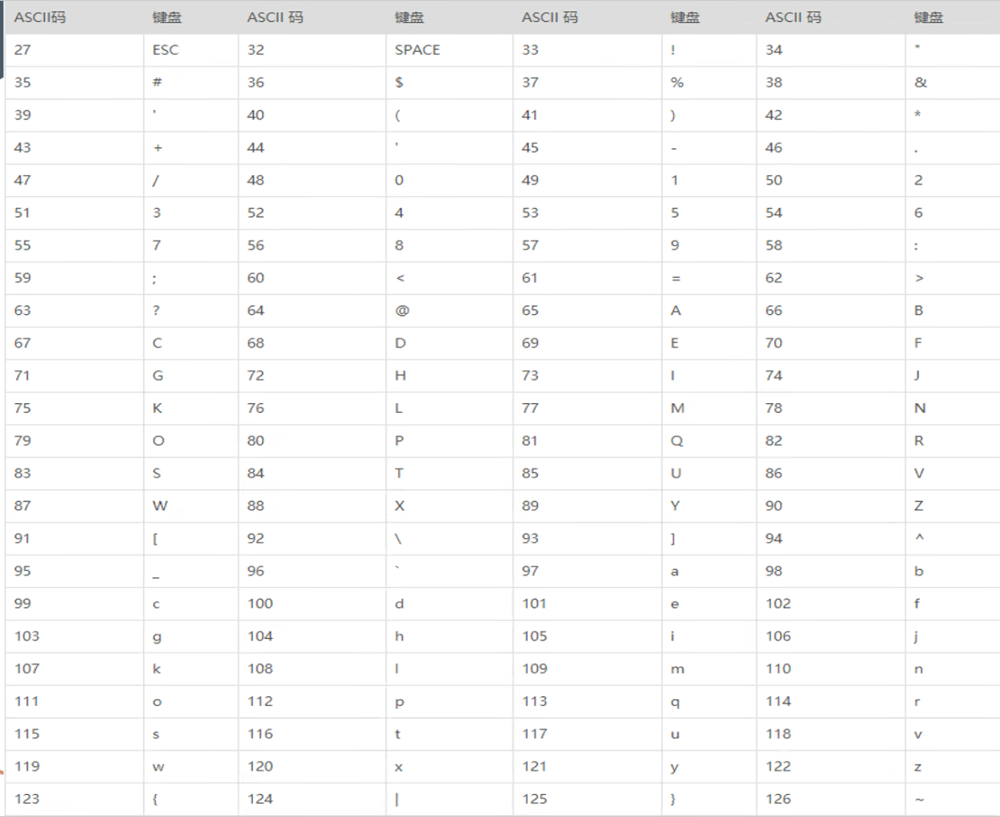
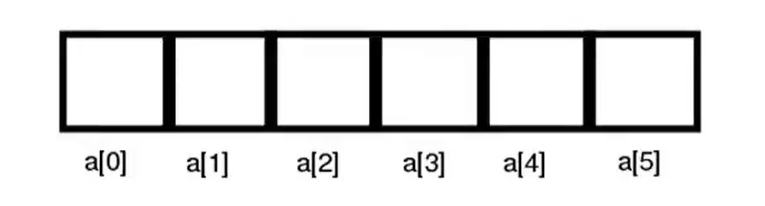

# 8.8~8.15笔记

### **1. 数据类型**

- **字节**

计算机专用的一种计量单位，一个字节代表了8个二进制位也就是256（0000 0000）2的8次方
两个字节（BYTE）构成一个字（WORD），两个字（WORD）构成一个双字（DOUBLE WORD）

双字可简写为DWORD，相当于四个字节

> Q：为什么会有数据类型？
>
> A：在C语言中，数据类型指的是用于声明不同类型的变量或函数的一个广泛的系统。变量的类型决定了变量储存占用的空间，以及如何结束储存的位模式。

#### C语言的数据类型共分为：

1.基本类型：包括整形（int），浮点型（float），字符型（char），和双精度浮点型（double）

2.枚举类型被用来定义在程序中只能赋予其一定的离散整数值的变量

3.void类型：表示没有值的数据类型，通常用于函数返回值

4.派生类型：包括数组类型，指针类型和结构体类型

- **有符号和无符号关键字**

Signed：类型默认位signed，也就是有符号数

Unisigned：可以搭配基本类型进行定义，无符号数关键字

有符号数和无符号数区分：

有符号数就是负数，正数就是正数；无符号数负数也代表了一个正数

```c
#include <stdio.h>
int main()
{
    int a=3;
    int b=-1;
    printf(" %d %u ",a,a);
    printf(" %d %u ",b,b);
    //%u就是unsigned int的占位符
    return 0;
}
```

输出的结果却是` 3 3  -1 4294967295  ` 4294967295可以看作范围的终点，而范围又可以看作是一个圆圈，过了这个终点又会变为起点，所以4294967295+1输出是0，这就是数据的溢出。

- **sizeof()操作符**：用来查看参数的大小，操作数可以是变量，也可以是数据类型

1.用于数据类型

sizeof使用形式：sizeof(type)	数据类型必须用括号括住：sizeof(int)

2.用于变量

sizeof使用形式：sizeo(var_name)或sizeof	var_name

变量名可以不用括号括住 如：sizeof(var_name), sizeof	var_name等都是正确形式

注意：sizeof操作符不能用于函数类型，不完全类型或位字段。

sizeof操作符的结果类型是**size_t**

#### 基本类型

字符型：关键字char类型，用于对小型整数或者字符变量进行定义，可以搭配unsigned做无符号数使用，当是有符号数时数据宽度是-128~127，当是无符号数的时候数据宽度是0~256.char类型大小是1字节，占位符是%c。

> 1字节==8比特(bit)==256

计算机表示字符的方式：

ascall码：计算机方便对英文字符进行编码的操作码，一个ascall码有八位(1字节)

unicode：计算机对各国字符统一进行的编码，一个unicode码有十六位(2字节)

- 短整形：关键字short类型，用于对较小整数进行定义，可以搭配unsigned做无符号数使用，当是有符号数时数据宽度时-32768~32767，当时无符号数的时候数据宽度是0~65535。short类型大小是2字节，占位符是%hd。

- 整形：关键字int类型，用于对一般整数进行定义，可以搭配unsigned做无符号数使用，当是有符号数时数据宽度时-2147483648~2147483647，当是无符号数的时候数据宽度是0~4294967296。int类型大小是4字节，占位符是%d。

- 浮点形：关键字float类型，用于对浮点数进行定义，数据宽度是1.2E-38~3.4E+38。float类型大小是4字节，占位符是%f，精度范围是6位有效位。

- 浮点形：关键字double类型，用于对浮点数进行定义，数据宽度是2.3E-308~3.4E+308。double类型大小是8字节，占位符是%f，精度范围是15位有效位。

- void类型

void，也就是无类型，"无效的或完全空白的"

最熟悉的用途是：

·虚函数返回类型

·虚函数作为功能参数

·空指针声明

空指针(void*)：void指针可以指向任意类型的数据，就是说可以用任意类型的指针对void指针对void指针赋值

当函数不需要返回值时，必须使用void限定，这就是我们所说的第一种情况。

例如：void func(int a,char *b)。

当函数不允许接受参数时，必须使用void限定，这就是我们所说的第二种情况。

例如：int func(void)。



### 2.函数

函数是一组一起执行一个任务的语句。每个C程序都至少有一个函数，即主函数main()，所有简单的

程序都可以定义其他额外的函数。

您可以把代码划分到不同的函数中。如何划分代码到不同的函数中是由您来决定的，但在逻辑上，花灯通常是根据每个函数执行一个特定的任务来进行的。

函数声明告诉编译器函数的名称、返回类型和参数。函数定义提供了函数的实际主体。

函数形式

return_type function_name(parameter list)
{
body of the function
}

在C语言中，函数由一个函数头和一个函数主体组成。下面列出一个函数的所有组成部分：

- 返回类型：一个函数可以i返回一个值。return_type是函数返回的值的数据类型。有些函数执行所需的操作而不返回值，在这种情况下，return_type是关键字void。
- 函数名称：这是函数的实际名称。函数名和参数古列表一起构成了函数签名。
- 参数：参数就像是占位符。当函数被调用时，您向参数传递一个值，这个值被称为实际参数。参数列表包括函数参数的类型、顺序、数量。参数是可选的，也就是说，函数可能不包含参数
- 函数主体：函数主体包括一组定义函数执行任务的语句。

函数例子

```c
#include <studio.h>
int add(int a ,int b)/*左边代码add()表示一个加法的函数*/
{
    int c = a + b;/*这个函数在被调用时传递了两个参数，第一个是a,第二个是b*/
    return c;
}/*函数功能是借用函数里面定义的一个变量c来对a和b相加，再将这个变量c传递出去(return)*/
int main()
{
    int a = 10;
    int b = 5;
    int c = add(a,b);
    printf("%d",c);
}
```

我们可以通过将函数封装起来形成⼀个头文件，只需在使用时从头文件中调用函数，就可以使得main函数里面只需要⼀个函数便实现题目所需要的各种功能。

### **3.数组**

- 数组定义(array)

数组是一个固定长度的储存相同数据类型的数据结构，数组中的元素被储存在一段连续的内存空间中。它是最简单的数据结构之一，大多数现代编程语言都内置数组支持。



数组特点

1.数组必须有相应的数据类型，而且数组里面元素的类型必须和数组本身的类型相对应。

2.数组元素的个数和数组本身的大小有关系。

3.数组通过下标遍历（循环）、寻找元素

4.数组可以被函数调用（数组本身是一个变量）

- 数组应用

数组可以把许多相同的元素整合到一起保存使用，比如对输入能够直接使用数组输入，而不必像之前一样将scanf放在for循环里面。

- 字符数组（字符串）

字符数组实际上是一系列字符的集合，也就是字符串(String)

在C语言中，没有专门的字符串变量，没有string类型，通常就用一个字符数组来存放一个字符串。在C语言中，字符串总是以 `\0`作为结尾，所以`\0`也被称为字符串结束标志，或者字符串结束符由`""`包围的字符串会自动在末尾添加`\0`。

例如：`"abc"`看起来只包含了3个字符，但C语言会在最后添加一个`\0`，但我们感受不到。而由`''`赋值的字符串则不会在末尾自动加\0，若要以`%s`输出，则会输出错误，应该在末尾手动添加`"\0"`。

- 多维数组

C语言的多维数组就相当于是元素为数组的数组（套娃）

数组例题：用数组逆序输出一组个数为0~10的数

```c
#include <stdio.h>
int main()
{
	int number=0;
	scanf_s("%d",&number);
	int array[10];
	for(int i=0;i<number;i++)
	{
		scanf_s("%d",&array[i]);
	}
	for(int i=0;i<number/2;i++)
	{
		 int temp=array[i];
		array[i]=array[number-i -1];
		array[number-i -1]=temp;
	}
	for(int i=0;i<number;i++)
	{
		printf("%d ",array[i]);
	}
}
```


