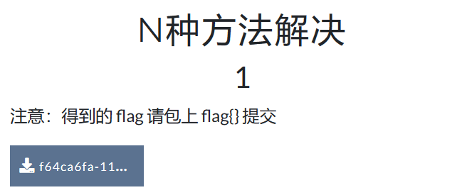
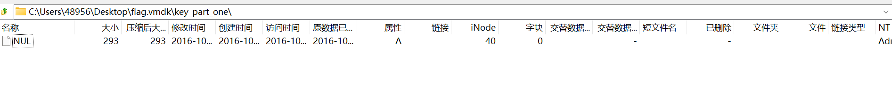

# BUU MISC第一页

### 1.签到

flag为：`flag{buu_ctf}`。

### 2.金三胖

本题来自buuctf，所用工具为PuzzleSolver。

题目给的附件下载之后得到的是一张金三胖的gif图片，我们仔细看会发现会有一瞬间闪烁出flag的字样，那我们可以猜到，flag一定是藏在这段gif图的某帧里。

打开PuzzleSolver中的ImageTools，调整到拆分GIF，对gif图进行拆分，就可以得到一个文件夹，里面是每一帧的图片。

我们把这其中包含flag的三张组合起来，就可以得到：

即flag可能为：`flag{hello_hongke}`、`flag{hellohongke}`或者`flag{_hello_hongke}`。

但奇怪的是这三条flag都无法提交。看了wp说flag是`flag{hello_hongke}`那这题我就算自己写出来了OwO。

### 3.你竟然赶我走

本题来自buuctf。

附件打开是一张图片，没啥特别的

用kali工具跑一遍，没有用，拿010看看：

好家伙，flag直接放在最后：`flag{stego_is_s0_bor1ing}`。

### 4.二维码

本题来自buuctf。

题目下载下来是一个二维码图片，扫一下：

看到这段话：`secret is here`，这玩意绝对不是flag，既然是图片，那用kali的工具跑一遍：

binwalk出来一个加密的zip压缩包，不知道密码，直接用工具爆破：

爆出来密码是`7639`，解压得到文件**4number.txt**：

得到flag，改下flag头：`flag{vjpw_wnoei}`。

### 5.大白

本题来自buuctf，所用软件为WinHex。

xxxxxxxxxx if(a) {    if(b) {        xxx    }else{        xxxx    }}else{    xxxxx}c

看起来这个大白好像不太对劲，下半身没有露出来，我猜测这题用的便是图片隐写，根据题目的提示，那么flag应该就藏在大白没有露出来的身体上。

用WinHex打开图片文件，找到第二行的这两个位置，在十六进制下，这两个对应的分别是图片的宽和高，我们将`01 00`也改成`02 A7`，这样我们就可以得到一张1：1大小的大白图片。

按下`cirl+s`进行保存，更新图片文件，得到：

在大白肚子上就写着本题的flag：`flag{He1l0_d4_ba1}`。

### 6.N种方法解决

用010打开得到一段base64密文，解密一下：

得到一个png图片，是一张二维码：

扫一下得到flag：`flag{dca57f966e4e4e31fd5b15417da63269}`。

### 7.乌镇峰会种图

本题来自buuctf。

这题下载下来是图片，扔进010：

直接找到flag：`flag{97314e7864a8f62627b26f3f998c37f1}`。

###   8.wireshark

本题来自buuctf。

附件下载下来用wireshark打开，先http过滤：

根据题目提示，找管理员登陆网站的那条记录，同时直接用字符串查找一下flag试试：

找到这一条，右键追踪tcp流：

password内容就是flag，本题flag为：`flag{ffb7567a1d4f4abdffdb54e022f8facd}`。

### 9.基础破解

这题下载下来是一个加密的压缩包，用ARCHPR直接暴力破解：

爆出来密码是`2563`，解压：

一眼base64加密：

得到flag：`flag{70354300a5100ba78068805661b93a5c}`。

### 10.文件中的秘密

本题来自buuctf。

下载下来得到的是一张图片：

用010看一下：

找到了flag：`flag{870c5a72806115cb5439345d8b014396}`。

本题还有另外两种方法：

第一种是直接右键打开属性，在详细属性的备注中就是flag：

第二种是在**Notepad++**中安装Hex插件，用16进制查看文件：

第二种和用010查看是一样的。

### 11.LSB

本题来自buuctf。

下载下来是这样的一个文件：

lsb是指最低有效位隐写，直接用stegslove打开查看：

注意文件头是一个PNG，点**Save Bin**保存：

回文件夹看发现图片居然变成了二维码，再用QR扫下：

改下flag头得到flag：`flag{1sb_i4_s0_Ea4y}`。

### 12.zip伪加密

本题来自buuctf，所用工具为010 Editor(也可使用WinHex)。

附件下载下来是一个压缩文件，我们不能直接打开flag文件，提示需要密码，联系题目叫做zip伪加密，所以我们使用工具来进行去加密。

压缩源文件数据区：50 4B 03 04：这是头文件标记

压缩源文件目录区：

50 4B 01 02：目录中文件文件头标记

3F 00：压缩使用的 pkware 版本 
14 00：解压文件所需 pkware 版本 
00 00：全局方式位标记（有无加密，这个更改这里进行伪加密，改为09 00打开就会提示有密码了）

压缩源文件目录结束标志 ：50 4B 05 06：目录结束标记 

因此我们将图中框出的`09 00`改为`00 00`并保存，就可以得到一个成功解压的文件夹：

打开就能找到flag了，本题flag为：`flag{Adm1N-B2G-kU-SZIP}`。

### 13.被嗅探的流量

本题来自buuctf。

下载的流量包用wireshark打开，照例先http过滤一下：

挨个看到这就找到flag了，追踪TCP流：

flag为`flag{da73d88936010da1eeeb36e945ec4b97}`。

### 14.rar

下载下来得到一个加密的rar压缩包，直接爆破四位纯数字密码：

得到密码`8795，解压得到flag：

flag为：`flag{1773c5da790bd3caff38e3decd180eb7}`。

### 15.qr

本题来自buuctf。

这题下载下来就是一个二维码：

用QR扫一下：

得到flag：`flag{878865ce73370a4ce607d21ca01b5e59}`。

### 16.镜子里面的世界

本题来自buuctf。

附件打开是这样的一张图片：

看不出什么东西，用stegsolve工具看看：

找到了，flag为：`flag{st3g0_saurus_wr3cks}`。

### 17.ningen

本题来自buuctf。

下载下来是这样的图片：

查看属性没问题，用010看看：

图片里面好像藏了压缩包，用binwalk分离一下：

得到一个加密的压缩包，拖出来用工具爆一下4位纯数字密码：

爆出来密码为`8368`

得到flag：`flag{b025fc9ca797a67d2103bfbc407a6d5f}`。

### 18.爱因斯坦

本题来自buuctf，使用的是kali虚拟机。

下载附件后得到的是一张爱因斯坦的照片，东看西看没啥提示，唯一奇怪的地方是属性中有一条备注。

没有思路后询问了学长，学长告诉我可以用kali的binwalk文件分离提取，我上网搜索了操作教程：

打开kali虚拟机，将附件中解压出的``misc2.jpg`文件拖进去

随后打开终端，按顺序输入以下两条指令，第一条的意思是转到桌面文件夹(因为我们的jpg文件就放在桌面)，第二条就是按照教程来写的，将这个jpg文件中的隐藏压缩文件分离出来。

此时我们桌面上就出现了这个文件夹，打开它就会看到藏着flag的压缩文件。

一路点开发现，想要得到flag竟然需要密码！那么密码是啥呢？还记得一开始在属性里面奇怪的备注吗？`this_is_not_password`，这个就是密码！OS：不得不说ctf真的有趣且折磨

输入密码，打开txt文件就得到本题的flag了：`flag{dd22a92bf2cceb6c0cd0d6b83ff51606}`。

### 19.小明的保险箱

本题来自buuctf。

看了题目描述，估计又是压缩包密码爆破，题目下载下来是一张图片:

先看属性没东西，再看010：

藏了个rar压缩包，binwalk出来：

用工具爆一下4位纯数字密码：

密码为：`7869`

得到flag：`flag{75a3d68bf071ee188c418ea6cf0bb043}`。

### 20.easycap

本题来自buuctf。

下载下来是一个流量包，发现只有TCP，追踪一下：

得到flag：`flag{385b87afc8671dee07550290d16a8071}`。

### 21.隐藏的钥匙

本题来自buuctf。

下载下来是这样的图片，看了属性没问题

看看010：

找到了flag，这个flag被base64加密了，在线解密一下：

得到flag：`flag{377cbadda1eca2f2f73d36277781f00a}`。

### 22.另外一个世界

本题来自buuctf。

下载下来是一张图片，看看属性没问题：

用010看到个怪东西：

一串二进制，翻译一下看看啥意思：

`koekj3s`?不知道是啥，用stegslove再看看图片也看不出来东西，去kali里面走一遍也没东西，那试试flag是不是`flag{koekj3s}`还真是。

本题的flag为：`flag{koekj3s}`。

### 23.FLAG

本题来自buuctf。

题目下载下来是这样的图片：

看看属性没问题，看看010好像也没问题，用stegslove看看lsb：

好家伙，是个zip文件，**save bin**保存为**1.zip**，解压看看：

好像坏了，看看能用啥打开解压出来的玩意，我把我有的都拖了一遍，好家伙，可以用ida打开：

找到flag：`flag{dd0gf4c3tok3yb0ard4g41n~~~}`。

搜了下这题的wp，先用**Notepad++**打开看看文件：

发现是ELF文件，所以才用ida打开。

### 24.神秘龙卷风

本题来自buuctf。

下载下来是一个带密码的压缩包，根据提示可以知道是4位纯数字密码，直接工具爆了：

密码为：`5463`

得到这个样子的代码：

一眼顶针，鉴定为Brainfuck加密：

得到flag：`flag{e4bbef8bdf9743f8bf5b727a9f6332a8}`

### 25.数据包中的线索

本题来自buuctf。

下载下来是流量包，打开先http过滤：

追踪http流：

好大一坨，鉴定为base64加密：

得到**.jpg**文件：

flag为：`flag{209acebf6324a09671abc31c869de72c}`。

### 26.假如给我三天光明

本题来自buuctf。

附件下载下来是这样的：

这张图片上面是盲文：

翻译过来是：`kmdonowg`，应该就是压缩包的密码，成功打开得到一个音频文件，用**Audacity**打开发现是摩斯密码：

翻译过来是：`-.-. - ..-. .-- .--. . .. ----- ---.. --... ...-- ..--- ..--.. ..--- ...-- -.. --..`

这玩意解密出来是大写的，但最后发现flag是小写，所以flag为：

`flag{wpei08732?23dz}`。

### 27.后门查杀

本题来自buuctf。

附件下载下来是一个网站源文件，搜索题目名字得知要下载WebShell扫描检测查杀工具，下载了河马查杀来做：

查到个php后门，去康康：

找到了，flag为：`flag{6ac45fb83b3bc355c024f5034b947dd3}`。

### 28.webshell后门

本题来自buuctf。

附件解压后也是一个网站源文件，直接开查：

一堆后门，进去康康：

找到了，那么flag为：`flag{ba8e6c6f35a53933b871480bb9a9545c}`。

### 29.来首歌吧

本题来自buuctf。

附件下下来是一个音频文件，打开康康：

一眼摩斯密码，翻译一下：`..... -... -.-. ----. ..--- ..... -.... ....- ----. -.-. -... ----- .---- ---.. ---.. ..-. ..... ..--- . -.... .---- --... -.. --... ----- ----. ..--- ----. .---- ----. .---- -.-.`

得到flag：`flag{5BC925649CB0188F52E617D70929191C}`。

### 30.荷兰宽带数据泄露

本题来自buuctf。

题目附件下载下来是**.bin**文件

这玩意还要再去下个工具：**routepassview**

用工具打开文件：

这边找到了username和password，试试哪个是flag。

flag是username的：`flag{053700357621}`。

### 31.面具下的flag

本题来自buuctf。

附件下载下来是一张图片：

感觉宽高不太对啊，改改看，用工具说没问题，看看010里面啥样：

有pk、有flag字样，试试binwalk分离：

分离出来一个压缩包，用010看发现是伪加密，把`09 00`改成`00 00`，保存：

成功解压出来：

在网上搜了，说用**.7z**就可以查看vmdk文件了，用看看：

可恶，在windows上面看不到，那试试Linux，打开kali输入`7z x flag.vmdk `，得到了文件夹：

一眼鉴定为Brainfuck，在线解密康康：

得到前半截flag：`flag{N7F5_AD5`

Ook解密：

得到后半截flag：`_i5_funny!}`

最终flag为：`flag{N7F5_AD5_i5_funny!}`。

### 32.九连环

本题来自buuctf。

附件下载下来是一张图片：

属性没事，010康康：

图片里面藏了压缩i包，用binwalk分离出来：

拖出来用010打开：

发现是zip伪加密，将`00 01`改为`00 00`就可以了

成功解压，得到另一个加密的文件夹。

这回好像是真的加密了，改了没用，那看看图片有没有藏东西：

binwalk没用，steghide发现藏了**ko.txt**文件，输入`steghide extract -sf good-已合并.jpg`提取出来

打开不知道是啥，试试是不是压缩包的密码，解压成功，得到flag：

flag为：`flag{1RTo8w@&4nK@z*XL}`。