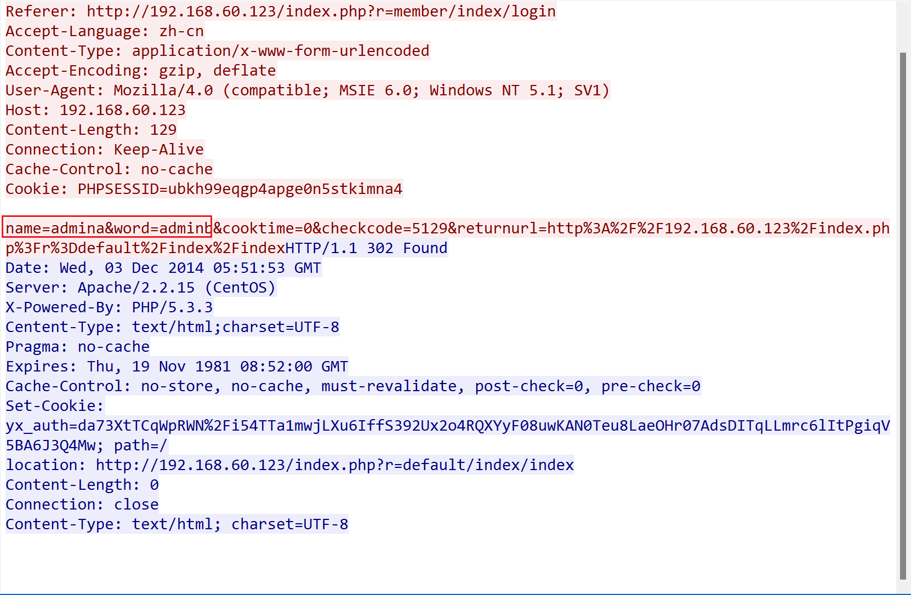
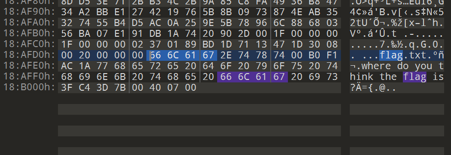
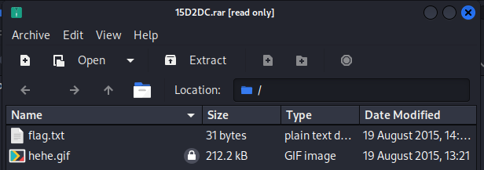
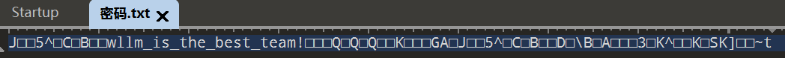

# BUU MISC第二页

### 1.被劫持的神秘礼物


这题是流量分析，上来先http过滤一下，这条比较可疑，追踪一下tcp流：




根据题目所写，”找到帐号密码，串在一起，用32位小写MD5哈希一下得到的就是答案“，那么本题答案为：`adminaadminb`，拿去用32位MD5哈希一下：


flag为：`flag{1d240aafe21a86afc11f38a45b541a49}`。

### 2.[BJDCTF2020]认真你就输了


下载下来是一个**.xls**文件，打开是这样，没有东西，用bandzip打开看看：


一顿翻找，找到了flag：`flag{M9eVfi2Pcs#}`。

### 3.[BJDCTF2020]藏藏藏


下载下来是一个图片，先看看属性没问题，再用010看看，有压缩包：


用kali，binwalk、foremost，得到压缩包：


打开得到二维码，扫一下得到本题的flag：`flag{you are the best!}`。

### 4.被偷走的文件


分析流量时找到了这条，将FTP过滤出来看看：


追踪看看，说明被偷走了**flag.rar**文件：


用foremost分离流量包看看：


成功得到一个加密的压缩包文件，尝试暴力破解：


发现是四位纯数字密码：`5790`

得到flag：`flag{6fe99a5d03fb01f833ec3caa80358fa3}`。

### 5.刷新过的图片


键盘上的刷新键快捷键是F5,可以得知这题应该是F5隐写，上网找工具下载下来：**F5-steganography-master**，一开始怎么都用不起来，后来才发现是java版本的问题。

#### 关于解决F5工具java版本问题的方法

解决java版本问题的原文链接：https://blog.csdn.net/pythllc/article/details/128969843

因为java版本是kali自带的17.0.5的版本，使用F5-steganography会出现报错，网上找到的博客中介绍的解决办法是安装java11，小版本不影响，改一下教程里面的版本就行，我下到的版本为**jdk-11.0.21_linux-x64_bin.tar.gz**，所以教程经过小改动后是：

1.下载好后，将压缩包移动到/etc/opt目录再进行解压

2.移动压缩包至opt目录

```
mv jdk-11.0.21_linux-x64_bin.tar.gz /etc/opt
```

3.移动好后切换至opt目录进行解压

```
cd /etc/opt
```

4.解压

```
tar -zxvf jdk-11.0.21_linux-x64_bin.tar.gz
```

5.拷贝解压后Java文件夹至/usr/bin

```
cp -r jdk-11.0.21/ /usr/bin
```

6.安装并注册

```
update-alternatives --install /usr/bin/java java /etc/opt/jdk-11.0.21/bin/java 1

update-alternatives --install /usr/bin/javac javac /etc/opt/jdk-11.0.21/bin/javac 1

update-alternatives --set java /etc/opt/jdk-11.0.21/bin/java

update-alternatives --set javac /etc/opt/jdk-11.0.21/bin/javac
```

现在就可以正常使用F5工具了。

#### F5工具的使用

执行F5工具的命令为：

```
java Extract /图片的绝对路径 [-p 密码] [-e 输出文件]
```

一般在CTF题目中，密码就是图片名字，本题并不需要输入密码


打开**output.txt**，发现PK开头，那这个应该是一个zip压缩包，改下后缀，发现文件被加密了，猜测是伪加密：


拖进010看一眼，果然是伪加密，`01 00`改成`00 00`：


成功得到flag：`flag{96efd0a2037d06f34199e921079778ee}`。

### 6.[GXYCTF2019]佛系青年


看题目就猜测是与佛论禅加密，下载下来发现压缩包里面被加密了,估计是伪加密：


果然是伪加密，把`09 00`改成`00 00`，成功解压出来：


在网上找了几个与佛论禅的网站，最终找到是Bugku的可以成功解密：


flag为：`flag{w0_fo_ci_Be1}`。

### 7.[BJDCTF2020]你猜我是个啥


下载下来是一个zip文件，但是用bandzip打开发现这个不是一个压缩包，用在线文件检查网站检查了一下，发现是个**png**文件


改完后缀给了一个二维码，扫看看：


哦？flag不在这里，用010看看，原来flag藏在这里啊：


flag为：`flag{i_am_fl@g}`。

### 8.snake


下载下来是一张图片，用010看一眼，好家伙，有两个压缩包：


用binwalk分离：


得到**cipher**和**key**两个文件，key里面是一段base64编码，翻译一下：


`What is Nicki Minaj's favorite song that refers to snakes?`根据这段提示，搜索得知答案为`anaconda`

在网上搜索与蛇相关的加密算法，找到了**Serpent加密**

找到了这个在线解密网站：[Serpent 加密 – 轻松加密或解密字符串或文件 (online-domain-tools.com)](http://serpent.online-domain-tools.com/)


成功得到flag：`flag{who_knew_serpent_cipher_existed}`。

### 9.秘密文件


猜测这题和之前那道**被偷走的文件**一样，先过滤一下**ftp**：


看着就很可疑，追踪一下tcp流：


找到被偷走的机密文件了，用kali去foremost分离一下：


得到一个加密的压缩包，爆一下得到压缩包密码为：`1903`


得到flag：`flag{d72e5a671aa50fa5f400e5d10eedeaa5}`。

### 10.[BJDCTF2020]just_a_rar


下载下来是一个加密的rar文件：


根据提示，是四位纯数字密码，爆破一下得到密码为：`2016`


解压得到图片：


第一步检查属性，结果直接找到了flag：


flag为：`flag{Wadf_123}`。

### 11.[BJDCTF2020]鸡你太美


解压发现鸡哥的gif图：


先拆分一下gif看看有没有暗藏玄鸡


整整200帧居然没藏东西，看看篮球副本，好像坏了打不开，用010看看发现好像少文件头


给他补全看看：


得到flag：`flag{zhi-yin-you-are-beautiful}`，但是发现交上去不对，查了wp发现buu上的flag是：`flag{zhi_yin_you_are_beautiful}`。

### 12.菜刀666


这题是流量分析，看了半天没办法，去参考wp了。

先过滤**POST**的包：

```
http.request.method==POST
```

在**tcp.stream eq 7**中发现了大量的数据


`FF D8`开头`FF D9`结尾，判断为`jpg`图片，将这些十六进制复制出来，以原始文件流写入文件：

##### 16进制转jpg图片

```python
#Author: MoChu7
import struct

a = open("str.txt","r")#十六进制数据文件
lines = a.read()
res = [lines[i:i+2] for i in range(0,len(lines),2)]

with open("res.jpg","wb") as f:
	for i in res:
		s = struct.pack('B',int(i,16))
		f.write(s)
```

得到图片：


这是一个密码，那么还会有个压缩包，在这段流中找到一个**hello.zip**压缩包，foremost分离一下流量包：


输入密码：`Th1s_1s_p4sswd_!!!`


得到flag：`flag{3OpWdJ-JP6FzK-koCMAK-VkfWBq-75Un2z}`。

### 13.[BJDCTF2020]一叶障目


下载解压就是一张图片，拖进010看看：


发现报错说crc不对，那应该是crc不正确，用工具爆破一下：


直接得到flag：`flag{66666}`。

### 14.[SWPU2019]神奇的二维码


这题下载下来是一个二维码，先拖进010看看，发现没东西，扫码看看：


flag不在这里，拖进kali里面binwalk看看，得到这些东西：


这是一段base64加密，解密得到：`asdfghjkl1234567890`

发现是那个加密的压缩包里面**flag.jpg**文件的密码，kali直接给我图片搞出来了，看看word文档：


超大一坨，猜测base64多次加密，试试：


我靠，base64加密了20层，以为得到flag：`flag{comEON_YOuAreSOSoS0great}`。错了！回头发现压缩包里面还有个音频文件，原来得到的``comEON_YOuAreSOSoS0great`是这个压缩包的密码，听了发现是摩斯密码：


```
-- --- .-. ... . .. ... ...- . .-. -.-- ...- . .-. -.-- . .- ... -.--
```


这边要都转成小写才是正确的flag：`flag{morseisveryveryeasy}`。

### 15.[BJDCTF2020]纳尼


打开发现gif图打不开，根据之前写的一题，猜测是修复文件头，用010看看，果然是：


修好打开一看，gif图里面每帧都是一段base64的部分，拆开发现总共4帧，提取文字汇总一下：


得到：`Q1RGe3dhbmdfYmFvX3FpYW5nX2lzX3NhZH0=`，解密得到flag：


flag为：`flag{wang_bao_qiang_is_sad}`。

### 16.梅花香之苦寒来


下载下来是一个图片，按照惯例看看属性：


有提示？拖进kali没找到东西，用010看看：


发现在文件后面藏了大量数据，感觉像**菜刀666**那题，这些应该也是16进制数据，需要脚本，上网搜wp，这是转换的脚本：

##### 16进制转字符串

```py
with open('hex.txt', 'r') as h:     # hex.txt为要转换的文本文件
    val = h.read()
    h.close()

with open('result.txt', 'w') as re: # 转换完成后写入result.txt
    tem = ''
    for i in range(0, len(val), 2):
        tem = '0x' + val[i] + val[i+1]
        tem = int(tem, base=16)
        print(chr(tem), end="")
        re.write(chr(tem))
    re.close()
```


得到一堆坐标，需要画图，用matplotlib画图片，脚本为：

##### 二维坐标画图

```python
import matplotlib.pyplot as plt
import numpy as np

# 逐行读取文件，去除括号并分割数值
with open('result.txt', 'r') as file:
    data = [line.strip('()\n').split(',') for line in file]

# 将字符串值转换为浮点数
x, y = np.array(data, dtype=float).T

# 绘制数据图
plt.plot(x, y, '.')
plt.show()
```

得到二维码：


得到flag：`flag{40fc0a979f759c8892f4dc045e28b820}`。

### 17.[HBNIS2018]excel破解


下载下来是一个**xls**文件，被加密了打不开，改成**zip**用010打开，搜索flag，结果直接找到了：


flag为：`flag{office_easy_cracked}`。

### 18.[HBNIS2018]来题中等的吧


这题下下来解压得到一个png


像摩斯密码，翻译一下是`.- .-.. .--. .... .- .-.. .- -...`，在线翻译出来是：`ALPHALAB`，用各种方法查了一遍图片，好像没东西了。

万一是flag呢？转换成小写提交看看：`flag{alphalab}`，还真是。

### 19.[ACTF新生赛2020]outguess


下载下来解压得到：


查看图片属性时发现备注应该是社会主义核心价值观加密：


解密得到：`abc`

模仿上题尝试提交看看，果然不对，回头搜搜guess是啥，找到一个工具叫**outguess**。

#### 使用outguess
输入outguess -help即可获得相关命令。

**注意在windows里面需要加`" "`而在Linux里面不需要**

- 加密：

```
outguess -k “my secret key” -d hidden.txt demo.jpg out.jpg
```
加密之后，demo.jpg会覆盖out.jpg，hidden.txt的内容是要隐藏的东西。

- 解密：

```
outguess -k “my secret key” -r out.jpg hidden.txt
```

解密之后，紧密内容放在hidden.txt中。

之前解密出来的**abc**应该就是**key**，那么本题的指令就是：

```
outguess -k abc -r mmm.jpg hidden.txt
```

得到flag：`flag{gue33_Gu3Ss!2020}`。

### 20.穿越时空的思念


下载下来是一个mp3文件，用audacity打开看看，里面好像有段摩斯：


`..-. ----- ..--- ----. -... -.. -.... ..-. ..... ..... .---- .---- ...-- ----. . . -.. . -... ---.. . ....- ..... .- .---- --... ..... -... ----- --... ---.. -....`

翻译出来是，再转成小写：

```
F029BD6F551139EEDEB8E45A175B0786

f029bd6f551139eedeb8e45a175b0786
```

套个flag头提交看看，结果就是flag，flag为：`flag{f029bd6f551139eedeb8e45a175b0786}`。

### 21.谁赢了比赛？


题目下载下来是一个png图片，是一个棋谱：


在010中看到了这个，貌似里面藏了一个**flag.txt**文件：



binwalk分离出来一个rar文件，里面有一个加密的gif文件：




爆破出密码是`1020`，得到gif图，拆分一下


找到一个与众不同的图片，图片上有这一句话，说明还没结束：


把这张图片扔进stegsolve，在Red 0通道发现有二维码：


扫一下成功得到flag：`flag{shanxiajingwu_won_the_game}`。

### 22.[WUSTCTF2020]find_me


下下来就是一个jpg文件，查看属性发现盲文：


用网站翻译得到flag：`flag{y$0$u_f$1$n$d$_M$e$e$e$e$e}`。

### 23.[SWPU2019]我有一只马里奥


运行发现多了一个**1.txt**文件，打开发现提示ntfs，即NTFS数据交换流。


#### 什么是NTFS数据流？
> NTFS交换数据流（alternate data streams，简称ADS）是NTFS磁盘格式的一个特性，在NTFS文件系统下，每个文件都可以存在多个数据流，就是说除了主文件流之外还可以有许多非主文件流寄宿在主文件流中。它使用资源派生来维持与文件相关的信息。————百度百科

> NTFS交换数据流（alternate data streams，简称ADS）是NTFS磁盘格式的一个特性，在NTFS文件系统下，每个文件都可以存在多个数据流，就是说除了主文件流之外还可以有许多非主文件流寄宿在主文件流中。它使用资源派生来维持与文件相关的信息，虽然我们无法看到数据流文件，但是它却是真实存在于我们的系统中的。创建一个数据交换流文件的方法很简单，命令为“宿主文件：准备与宿主文件关联的数据流文件”。————百度百科

#### NTFS数据流隐藏文件的方法和实例

创建一个数据交换流文件的方法，命令为“宿主文件：准备与宿主文件关联的数据流文件”。

##### 1.单文件流隐藏

先在F盘中新建一个空的文本文件，命名为m0re.txt，
创建一个NTFS数据流，

```bash
echo "i am a test" > :m0re.txt
```

已经成功的隐藏信息，查看方式有两种
一种是使用windows自带的notepad查看，命令如下

```bash
notepad :m0re.txt
```

第二种方法是使用工具，`lads.exe`

```bash
lads.exe /S
```

扫描到这个文件存在NTFS数据流，然后用第一种方法显示出来。

##### 2.关联文件流

```
echo "https://m0re.top" > lalala.txt:m0re.txt
```

此时的m0re.txt是宿主文件，将信息内容隐藏到宿主文件中了，直接打开lalala.txt:m0re.txt查看数据流文件

这里需要注意的是这个不是将数据写入到文件中，而是创建了NTFS数据流，信息都在数据流当中。这个`lalala.txt:m0re.txt`就是创建的流文件。

当然不止可以隐藏文本数据，还可以隐藏其他的文件，比如exe可执行文件，pyc文件等

这里使用type命令，来隐藏文件。

```
#隐藏图片到另一张图片中
type yincang.jpg >yincang.jpg:suzhu.jpg

#查看方式使用windows自带的mspaint.exe
mspaint.exe yincang.jpg:suzhu.jpg
```

那么在本题中，先将文件都放在同一个文件夹中，再输入这个指令：

```
notepad 1.txt:flag.txt
```


就能得到flag：`flag{ddg_is_cute}`。

### 24.[GUET-CTF2019]KO


 下载下来是Ook解密;

```
Ook. Ook. Ook. Ook. Ook. Ook. Ook. Ook. Ook. Ook. Ook. Ook. Ook. Ook. Ook.
Ook. Ook. Ook. Ook. Ook. Ook! Ook? Ook! Ook! Ook. Ook? Ook. Ook. Ook. Ook.
Ook. Ook. Ook. Ook. Ook. Ook. Ook. Ook. Ook. Ook. Ook. Ook. Ook. Ook. Ook.
Ook. Ook? Ook. Ook? Ook! Ook. Ook? Ook. Ook. Ook. Ook. Ook. Ook. Ook. Ook.
Ook. Ook. Ook. Ook. Ook. Ook. Ook. Ook. Ook. Ook. Ook. Ook. Ook. Ook. Ook.
Ook. Ook. Ook. Ook. Ook. Ook. Ook. Ook. Ook. Ook. Ook. Ook. Ook. Ook. Ook.
Ook! Ook. Ook? Ook. Ook. Ook. Ook. Ook. Ook. Ook. Ook. Ook. Ook! Ook? Ook!
Ook! Ook. Ook? Ook! Ook! Ook! Ook! Ook! Ook! Ook! Ook! Ook? Ook. Ook? Ook!
Ook. Ook? Ook! Ook! Ook! Ook! Ook! Ook. Ook. Ook. Ook. Ook. Ook. Ook. Ook.
Ook. Ook. Ook. Ook. Ook. Ook. Ook. Ook! Ook. Ook! Ook! Ook! Ook! Ook! Ook!
Ook! Ook! Ook! Ook! Ook! Ook! Ook! Ook! Ook! Ook! Ook! Ook! Ook! Ook. Ook?
Ook. Ook. Ook. Ook. Ook. Ook. Ook. Ook! Ook? Ook! Ook! Ook. Ook? Ook. Ook.
Ook. Ook. Ook. Ook. Ook? Ook. Ook? Ook! Ook. Ook? Ook. Ook. Ook. Ook. Ook.
Ook. Ook! Ook. Ook! Ook! Ook! Ook! Ook! Ook. Ook! Ook! Ook! Ook! Ook! Ook!
Ook! Ook! Ook! Ook! Ook! Ook! Ook! Ook! Ook! Ook! Ook! Ook. Ook? Ook. Ook.
Ook. Ook. Ook. Ook. Ook. Ook. Ook. Ook. Ook. Ook. Ook. Ook. Ook. Ook. Ook.
Ook! Ook? Ook! Ook! Ook. Ook? Ook! Ook! Ook! Ook! Ook! Ook! Ook! Ook! Ook!
Ook! Ook! Ook! Ook! Ook! Ook! Ook! Ook? Ook. Ook? Ook! Ook. Ook? Ook! Ook!
Ook! Ook! Ook! Ook! Ook! Ook! Ook! Ook! Ook! Ook. Ook? Ook. Ook. Ook. Ook.
Ook. Ook. Ook. Ook. Ook. Ook. Ook. Ook. Ook. Ook. Ook. Ook. Ook. Ook. Ook.
Ook! Ook? Ook! Ook! Ook. Ook? Ook. Ook. Ook. Ook. Ook. Ook. Ook. Ook. Ook.
Ook. Ook. Ook. Ook. Ook. Ook. Ook. Ook. Ook. Ook? Ook. Ook? Ook! Ook. Ook?
Ook. Ook. Ook. Ook. Ook. Ook. Ook! Ook. Ook! Ook! Ook! Ook! Ook! Ook! Ook!
Ook! Ook! Ook! Ook! Ook. Ook? Ook. Ook. Ook. Ook. Ook. Ook. Ook. Ook. Ook.
Ook. Ook. Ook. Ook. Ook. Ook. Ook. Ook. Ook! Ook? Ook! Ook! Ook. Ook? Ook!
Ook! Ook! Ook! Ook! Ook! Ook! Ook! Ook! Ook! Ook! Ook! Ook! Ook! Ook! Ook!
Ook? Ook. Ook? Ook! Ook. Ook? Ook! Ook! Ook! Ook! Ook! Ook! Ook! Ook! Ook!
Ook! Ook! Ook! Ook! Ook! Ook! Ook! Ook! Ook! Ook! Ook! Ook! Ook! Ook! Ook!
Ook! Ook! Ook! Ook! Ook! Ook! Ook! Ook. Ook? Ook. Ook. Ook. Ook. Ook. Ook.
Ook. Ook. Ook. Ook. Ook. Ook! Ook? Ook! Ook! Ook. Ook? Ook. Ook. Ook. Ook.
Ook. Ook. Ook. Ook. Ook. Ook. Ook? Ook. Ook? Ook! Ook. Ook? Ook. Ook. Ook.
Ook. Ook. Ook. Ook. Ook. Ook. Ook. Ook. Ook. Ook. Ook. Ook. Ook. Ook. Ook.
Ook. Ook. Ook! Ook. Ook? Ook. Ook. Ook. Ook. Ook. Ook. Ook. Ook. Ook. Ook!
Ook? Ook! Ook! Ook. Ook? Ook. Ook. Ook. Ook. Ook. Ook. Ook. Ook. Ook? Ook.
Ook? Ook! Ook. Ook? Ook. Ook. Ook! Ook. Ook? Ook. Ook. Ook. Ook. Ook. Ook.
Ook. Ook! Ook? Ook! Ook! Ook. Ook? Ook! Ook! Ook! Ook! Ook! Ook! Ook? Ook.
Ook? Ook! Ook. Ook? Ook! Ook! Ook! Ook! Ook! Ook! Ook! Ook! Ook! Ook! Ook!
Ook. Ook? Ook.
```

用在线网站翻译一下，得到：`welcome to CTF`，包上flag头，得到本题的flag：`flag{welcome to CTF}`。

### 25.[GXYCTF2019]gakki


下下来是一个jpg图片，放进010里面可以找到藏了rar文件：


binwalk一下得到一个加密的rar压缩包，用工具爆出来密码`8864`：


打开得到这样的一大坨密文：


没找到是啥加密，去搜了搜，发现是字频统计，用puzzlesolver工具做：


得到flag：`flag{gaki_IsMyw1fe}`。

### 26.[ACTF新生赛2020]base64隐写


解压下来就是


上网找了base64隐写的脚本，个别的用gpt改了改能用了：

#### base64隐写脚本

```py
import base64

def get_base64_diff_value(s1, s2):
    base64chars = b'ABCDEFGHIJKLMNOPQRSTUVWXYZabcdefghijklmnopqrstuvwxyz0123456789+/'
    res = 0
    for i in range(len(s2)):
        if s1[i] != s2[i]:
            return abs(base64chars.index(s1[i:i+1]) - base64chars.index(s2[i:i+1]))
    return res

def solve_stego():
    with open('ComeOn!.txt', 'rb') as f:
        file_lines = f.readlines()
        bin_str = b''
        for line in file_lines:
            steg_line = line.replace(b'\n', b'')
            norm_line = base64.b64encode(base64.b64decode(steg_line)).replace(b'\n', b'')
            diff = get_base64_diff_value(steg_line, norm_line)
            print(diff)
            pads_num = steg_line.count(b'=')
            if diff:
                bin_str += bin(diff)[2:].zfill(pads_num * 2).encode()
            else:
                bin_str += b'0' * pads_num * 2
            print(goflag(bin_str))

def goflag(bin_str):
    res_str = b''
    for i in range(0, len(bin_str), 8):
        res_str += bytes([int(bin_str[i:i + 8], 2)])
    return res_str.decode()

if __name__ == '__main__':
    solve_stego()
```

```py
import base64

b64chars = 'ABCDEFGHIJKLMNOPQRSTUVWXYZabcdefghijklmnopqrstuvwxyz0123456789+/'

with open('ComeOn!.txt', 'rb') as f:
    flag = ''
    bin_str = ''
    for line in f.readlines():
        stegb64 = str(line, "utf-8").strip("\n")
        rowb64 = str(base64.b64encode(base64.b64decode(stegb64)), "utf-8").strip("\n")
        offset = abs(b64chars.index(stegb64.replace('=', '')[-1]) - b64chars.index(rowb64.replace('=', '')[-1]))
        equalnum = stegb64.count('=')  # no equalnum no offset
        if equalnum:
            bin_str += bin(offset)[2:].zfill(equalnum * 2)

print("".join([chr(int(bin_str[i:i + 8], 2)) for i in range(0, len(bin_str), 8)]))
```

这两个脚本的功能是一样的，可以都存着。


最后得到flag：`flag{6aseb4_f33!}`。

### 27.[MRCTF2020]ezmisc


下载下来得到一个png图片，用010打开的时候发现了CRC校验错误，估计宽高有问题，用工具一把梭：


得到flag：`flag{1ts_vEryyyyyy_ez!}`。

### 28.[HBNIS2018]caesar


好像是凯撒密码，但是不知道偏移了多少位，只能穷举，没办法只能上网找脚本：

#### 凯撒密码穷举脚本

```py
def change(c,i):
    num=ord(c)
    if(num>=33 and num<=126):
        num=33+(num+i-33)%(94)#126-33=93
    return chr(num)
 
  
def kaisa_jiAmi(string,i):
    string_new=''
    for s in string:
        string_new+=change(s,i)
    print(string_new)
    return string_new
 
#本题有种暴力解密感觉
def kaisa_jiEmi(string):
    for i in range(0,94):
        print('第'+str(i+1)+'种可能:',end='  ')
        #区别在于 string 是该对象原本就是字符串类型, 而 str()则是将该对象转换成字符串类型。
        kaisa_jiAmi(string,i)
    
#你要知道input输入的数据类型都是string  
def main():
    print('请输入操作，注意不是平常26种:')
    choice=input('1:恺撒加密,2:凯撒穷举解密.请输入1或2：')
    if choice=='1':
        string=input('请输入需要加密字符串： ')
        num=int(input('请输入需要加密的KEY： '))
        kaisa_jiAmi(string,num)
    elif choice=='2':
        string=input('请输入需要解密字符串： ')
        kaisa_jiEmi(string)
    else:
        print('输入错误，请重试')
        main()
    
if __name__=='__main__':
    main()

```


得到flag：`flag{flagiscaesar}`。

### 29.[SWPU2019]伟大的侦探


下载下来得到一个压缩包，里面有密码提示和一组加密的图片：


用010打开**密码.txt**，发现使用`EBCDIC`编码时，得到了`wllm_is_the_best_team!`，这个应该就是解压的密码。




解压得到一组跳舞小人的图片，这个是**福尔摩斯小人密码**


对照密码表解出`iloveholmesandwllm`：


flag为：`flag{iloveholmesandwllm}`。

###  30.黑客帝国


下载得到这样的一组数据：


查看数据发现`526172211a070000`很像16进制数据，用winhex创建一个文件看看：


是一个rar文件，这边有一个16进制转rar的脚本，也可以使用这个来得到rar：

#### 16进制转rar

```py
def hex_to_rar(hex_string, output_file):
    # 将16进制字符串转换为bytes
    binary_data = bytes.fromhex(hex_string)

    # 将bytes写入RAR文件
    with open(output_file, 'wb') as file:
        file.write(binary_data)

if __name__ == "__main__":
    # 输入16进制字符串
    hex_data = "16进制字符串"

    # 指定输出RAR文件名
    output_file_name = "output.rar"

    # 调用函数进行转换
    hex_to_rar(hex_data, output_file_name)

    print(f"成功将16进制字符串转换为RAR文件: {output_file_name}")
```

保存后打开发现是加密的，用工具爆破一下：


得到密码`3690`打开得到一个损坏的png文件，应该是要修复：


但是查看了文件头尾之后，发现这是一个jepg文件的文件头被改成了png，将`B9 50 4E 47`改成`FF D8 FF E0`，保存后得到正确的图片：


flag为：`flag{57cd4cfd4e07505b98048ca106132125}`。

### 31.[HBNIS2018]低个头


熟悉的感觉，是键盘加密，翻译一下得到明文：`CTF`


flag为：`flag{CTF}`。

### 32.[MRCTF2020]你能看懂音符吗


题目下载下来的rar压缩包是坏的，打开发现文件头错了，修复一下


应该是把文字隐藏了，或者文字改为了白色，直接`cirl+a`选中所有文字，右键查看字体，果然是隐藏了。


```
♭♯♪‖¶♬♭♭♪♭‖‖♭♭♬‖♫♪‖♩♬‖♬♬♭♭♫‖♩♫‖♬♪♭♭♭‖¶∮‖‖‖‖♩♬‖♬♪‖♩♫♭♭♭♭♭§‖♩♩♭♭♫♭♭♭‖♬♭‖¶§♭♭♯‖♫∮‖♬¶‖¶∮‖♬♫‖♫♬‖♫♫§=
```

用在线网站翻译一下得到flag。


flag为：`flag{thEse_n0tes_ArE_am@zing~}`。

